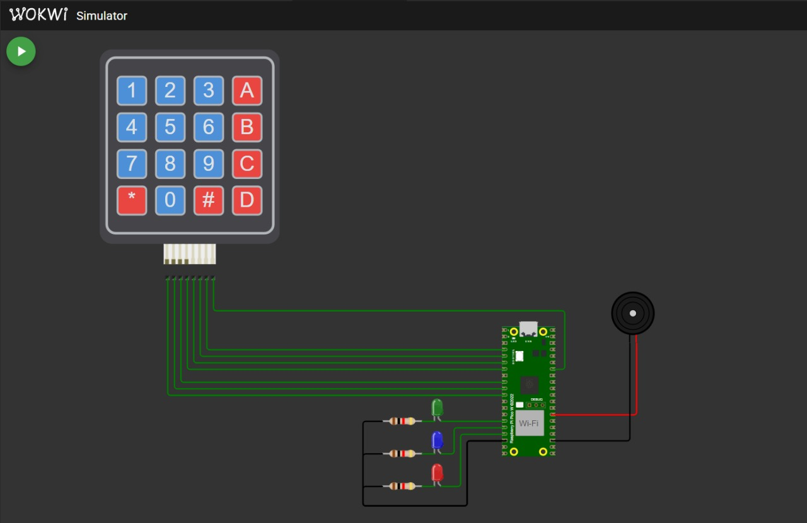

# Controle de Pinos GPIO com o Emprego de um Teclado Matricial

## 📋 Sobre

 

Este projeto envolve a utilização de um teclado matricial 4x4, LEDs RGB e um buzzer em uma placa **Raspberry Pi Pico**. Através da interação com teclas específicas no teclado matricial, é possível acender os LEDs e gerar efeitos sonoros no buzzer.

## 🚀 Funcionalidades

- **Leitura de Teclado Matricial 4x4:** Detecta as teclas pressionadas e executa as ações designadas.
- **Controle de LEDs RGB:** Acende os LEDs RGB (Red, Green e Blue) de acordo com as teclas pressionadas.
- **Controle do Buzzer:** Emite sons ao pressionar teclas específicas.

## 🛠️ Instruções de Uso

 O projeto foi desenvolvido utilizando o Simulador Wokwi (Figura 1). Abaixo está o mapeamento das teclas do teclado matricial 4x4 e suas respectivas ações nos LEDs RGB e no buzzer: 

    
     
    Figura 1. Simulador Wokwi

### 🎹 Mapeamento do Teclado Matricial
| Tecla | Ação                                 |
|-------|--------------------------------------|
| A     | Acende o LED vermelho                |
| B     | Acende o LED azul                    |
| C     | Acende o LED verde                   |
| D     | Acende todos os LEDs                 |
| #     | Emite tom agudo no buzzer (2000 Hz)  |
| *     | Emite tom grave no buzzer (500 Hz)   |
| 0     | Reproduz um padrão de som no buzzer  |
| Outras | Apaga todos os LEDs                 |

---

## 🏆 Resultado Obtido

 Solução trabalhada e resultados obtidos no experimento:

## 👨‍💻 Contribuidores: 
- [Adrian Trajano](https://github.com/AdrianTr97)
- [Eduardo Lino](https://github.com/Linosz)
- [Emmanuel Souza](https://github.com/EmmanuelS-S) 
- [Gabriel Marcone](https://github.com/gabrielmarcone)
- [Kauan Teixeira](https://github.com/kauanth21)
- [Matheus Amorim](https://github.com/Matheus0o0)
- [Vitória Tanan](https://github.com/vitoriatanan)

